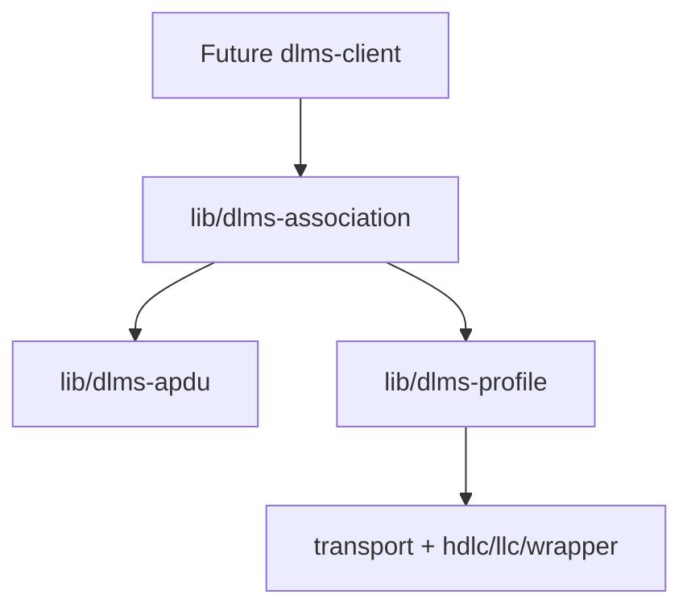
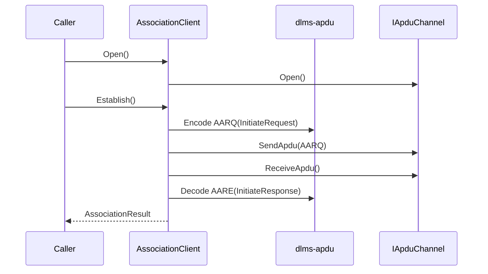
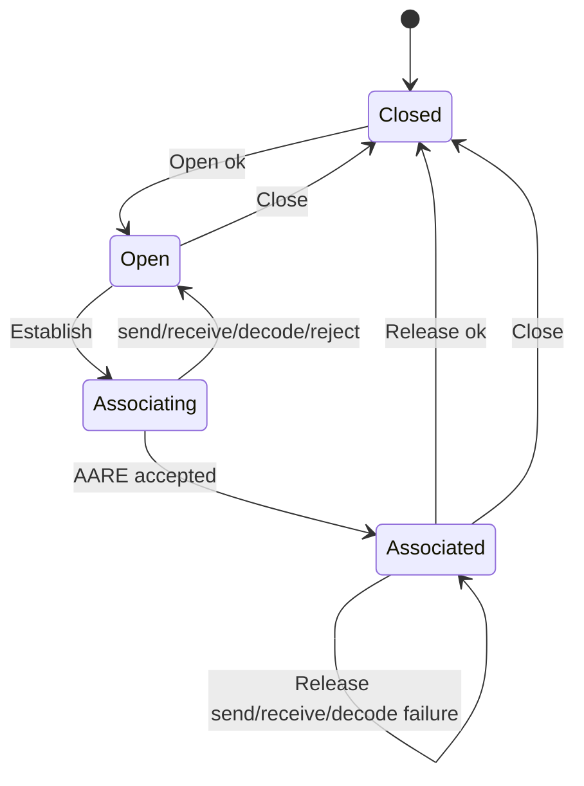
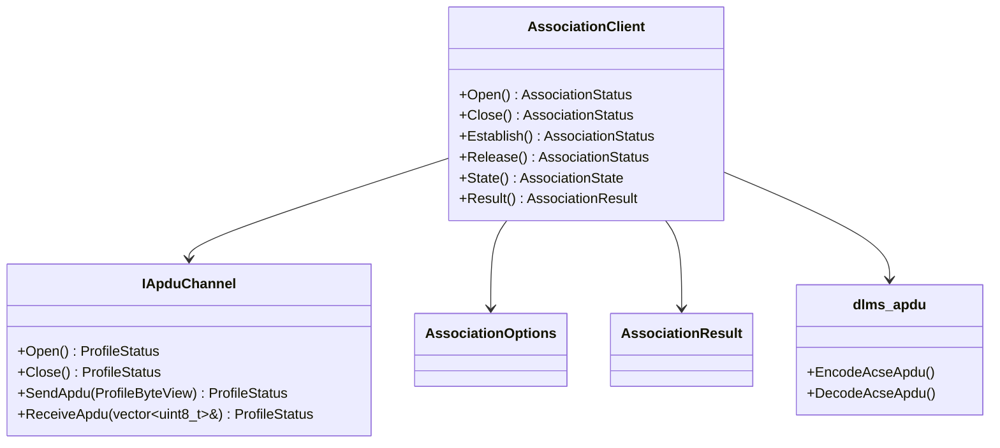

# dlms-association Architecture

## 1. Layer Position

## 2. Open Handshake

## 3. State Machine

## 4. Class Interaction

## 5. Ownership

`AssociationClient` stores a reference to `dlms::profile::IApduChannel`. It
does not own the channel and does not own transport resources directly.
