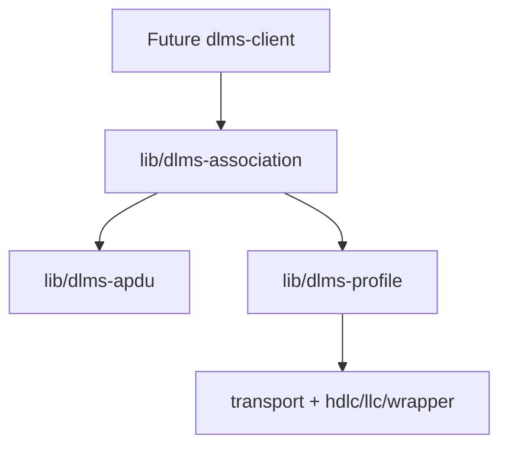
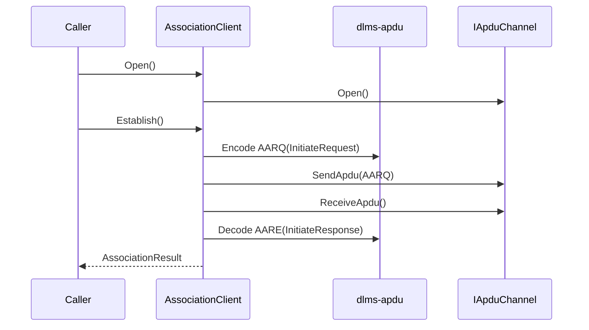
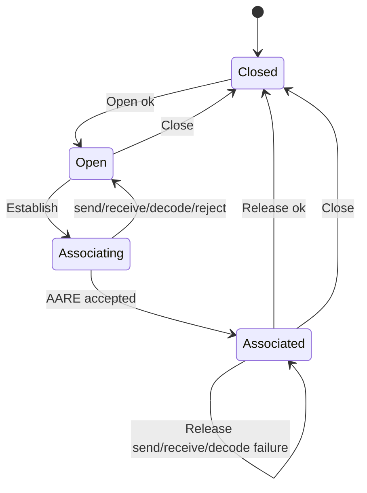
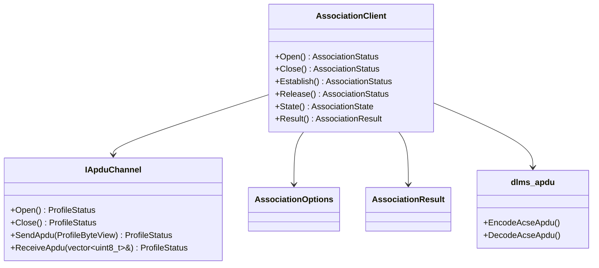
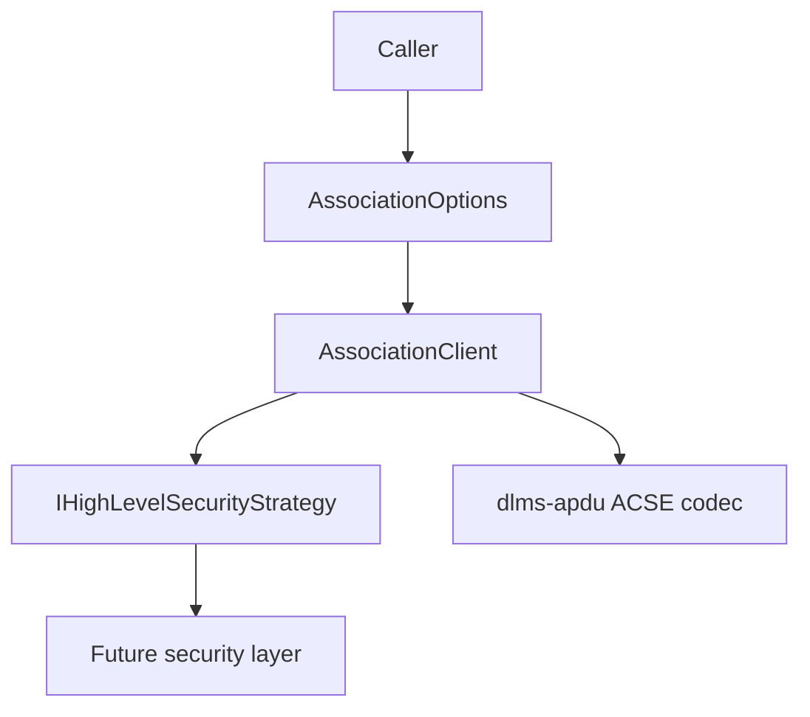
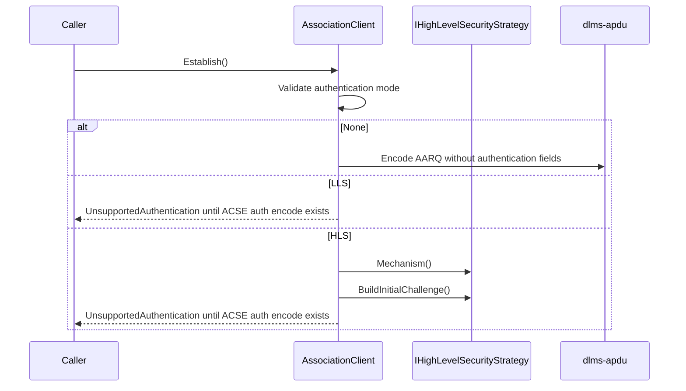

# dlms-association Architecture

## 1. Layer Position

## 2. Open Handshake

## 3. State Machine

## 4. Class Interaction

## 5. Ownership

`AssociationClient` stores a reference to `dlms::profile::IApduChannel`. It
does not own the channel and does not own transport resources directly.

## 6. Authentication Boundary

`dlms-association` owns only the association state machine and option
validation. Authentication mechanism OIDs, ACSE authentication fields,
challenge functions, ciphering, keys, and invocation counters remain delegated
to `dlms-apdu` or a future security layer.
