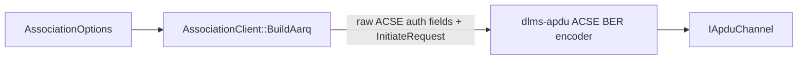
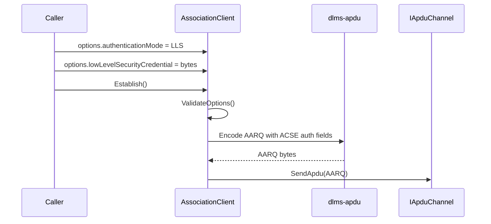

# LLS Authentication Plan

## 1. Scope

This document defines the first implemented authentication boundary for
`dlms-association`: Low Level Security (LLS) AARQ construction.

The layer already owns the association open state machine and already exposes
`AssociationOptions::lowLevelSecurityCredential`. This phase turns that modeled
credential into ACSE authentication fields in the outgoing AARQ APDU.

## 2. Requirements

LLS association shall:

- require a non-empty caller-provided credential;
- keep `AuthenticationMode::None` behavior unchanged;
- add ACSE authentication functional-unit fields to AARQ only for
  `AuthenticationMode::LowLevelSecurity`;
- encode `sender-acse-requirements` with authentication bit set;
- encode `mechanism-name` as COSEM low-level-security mechanism name
  `2.16.756.5.8.2.1`;
- encode `calling-authentication-value` as the caller-provided credential bytes
  in the charstring authentication-value choice;
- keep HLS rejected until the HLS pass-3/pass-4 exchange is explicitly
  implemented;
- keep key storage, password derivation, hashing, and cryptographic algorithms
  out of this repository.

Normative alignment from document RAG:

- LLS selects the ACSE authentication functional unit in the AARQ request.
- The mechanism name is present when authentication is selected.
- The calling authentication value carries the client authentication value for
  the selected mechanism.
- DLMS/COSEM examples encode the LLS mechanism object identifier as
  `60 85 74 05 08 02 01` and the calling authentication value as
  `AC len 80 credential-len credential-bytes`.

## 3. Out Of Scope

- HLS GMAC challenge exchange;
- MD5/SHA1 HLS mechanisms;
- ciphered application contexts;
- credential persistence;
- credential transformation.

The credential bytes are sent exactly as supplied by the caller.

## 4. Architecture



## 5. Class Interaction



## 6. Error Model

| Condition | Status |
|---|---|
| LLS selected with empty credential | `UnsupportedAuthentication` |
| LLS selected with non-empty credential | continue with AARQ encoding |
| encoded AARQ exceeds APDU buffer | `EncodeFailed` |
| channel send failure | `SendFailed` |
| AARE rejection | `AssociationRejected` |

## 7. Test Plan

Unit tests shall cover:

- LLS without credential is rejected before sending;
- LLS with credential sends AARQ;
- encoded AARQ contains `sender-acse-requirements`;
- encoded AARQ contains low-level-security mechanism name;
- encoded AARQ contains the exact credential bytes;
- no-security AARQ remains unchanged by the LLS phase;
- HLS remains rejected.

Root integration is deferred until `dlms-client` exposes public LLS options and
the live smoke can pass a credential from environment variables.

## 8. Implementation Phases

### Phase 44. LLS Authentication Documentation

Deliverables:

- this plan;
- updated requirements, API, architecture, and test plan.

Commit message:

```text
docs(association): define LLS AARQ authentication
```

### Phase 45. LLS AARQ Authentication Fields

Deliverables:

- LLS option validation that accepts non-empty credentials;
- AARQ ACSE authentication field construction;
- unit tests for encoded fields and rejection paths.

Commit message:

```text
feat(association): encode LLS AARQ authentication
```

