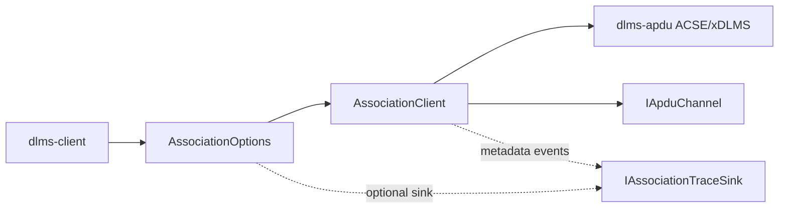
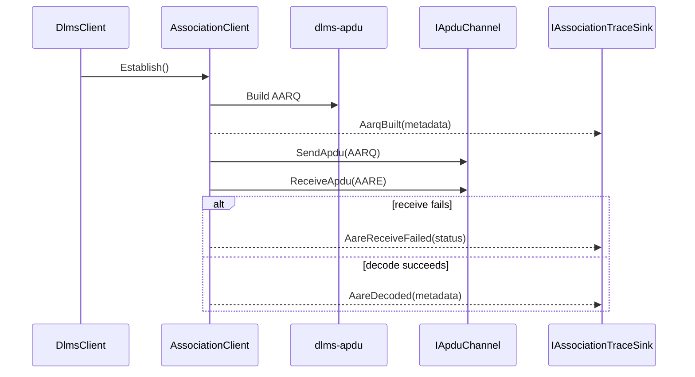

# Association Trace Plan

## Goal

Expose an opt-in association trace hook that reports non-secret AARQ/AARE
metadata. The first consumer is the root live smoke tool after WRAPPER frame
trace has proven that AARQ WPDUs are written but no AARE is received from the
lab meter.

The trace must answer: "What association request did we build?" without
printing passwords, HLS challenges, keys, system titles, invocation counters, or
raw APDU payloads.

## Requirements

- Trace is disabled by default.
- `AssociationOptions` stores a nullable non-owning sink pointer.
- Existing callers continue to compile without source changes.
- Trace events must include:
  - event kind;
  - association status;
  - application context;
  - authentication mode;
  - HLS mechanism when selected;
  - proposed DLMS version;
  - proposed conformance bytes;
  - client max receive PDU size;
  - encoded AARQ size;
  - ACSE raw field tags and encoded lengths;
  - calling-authentication-value length only.
- Trace must not expose credential/challenge bytes.
- C API support is out of scope for the first phase.

## C++ API Sketch

```cpp
enum class AssociationTraceKind
{
  AarqBuilt,
  AarqBuildFailed,
  AareReceiveFailed,
  AareDecodeFailed,
  AareDecoded
};

struct AssociationTraceField
{
  std::uint8_t tag;
  std::size_t encodedSize;
};

struct AssociationTraceEvent
{
  AssociationTraceKind kind;
  AssociationStatus status;
  ApplicationContext applicationContext;
  AuthenticationMode authenticationMode;
  HighLevelSecurityMechanism hlsMechanism;
  std::uint8_t proposedDlmsVersionNumber;
  dlms::apdu::AxdrConformance proposedConformance;
  std::uint16_t clientMaxReceivePduSize;
  std::size_t encodedAarqSize;
  std::size_t callingAuthenticationValueSize;
  const AssociationTraceField* fields;
  std::size_t fieldCount;
};

class IAssociationTraceSink
{
public:
  virtual ~IAssociationTraceSink() {}
  virtual void OnAssociationTrace(const AssociationTraceEvent& event) = 0;
};
```

`AssociationOptions::traceSink` defaults to null.

The `fields` pointer is non-owning and valid only during the callback. Callers
that need persistence must copy field metadata themselves.

## Architecture





## Test Plan

- `DefaultAssociationOptions` leaves `traceSink` null.
- Successful no-authentication AARQ emits `AarqBuilt` with version,
  conformance, max PDU size, encoded size, and no authentication value length.
- LLS AARQ trace reports auth mode and credential length only.
- HLS High trace reports mechanism and challenge length only.
- AARE receive failure emits `AareReceiveFailed`.
- Existing association tests continue to pass.

## Phase Commit Message

```text
docs(association): define association trace hook

Document an opt-in AssociationClient trace hook for non-secret AARQ/AARE
metadata. The plan covers the C++ event API, live smoke use case, ownership
rules, and deterministic tests for AARQ structure and AARE receive failures.

Verification: documentation-only phase.
```
