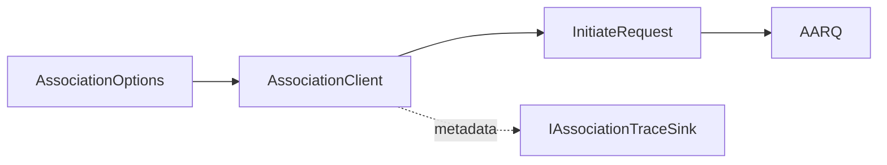

# Association QoS Option Plan

## 1. Scope

Expose the optional xDLMS InitiateRequest `proposed-quality-of-service` field
through `AssociationOptions`.

The APDU layer already supports encoding and decoding this field. The
association layer needs a controlled option so certification probes can send a
non-default QoS value without manually patching AARQ bytes.

## 2. Requirements

- `AssociationOptions` shall expose whether proposed QoS is present.
- `AssociationOptions` shall expose the proposed QoS value.
- `DefaultAssociationOptions()` shall keep current behavior by omitting QoS.
- `AssociationClient::BuildAarq()` shall forward the option into
  `InitiateRequest`.
- `AssociationTraceEvent` shall report the QoS presence flag and value.
- Validation shall allow signed QoS values when explicitly configured. Meter
  acceptance remains part of AARQ/AARE negotiation.
- The option shall not affect authentication fields, conformance, DLMS version,
  or client max PDU size.

## 3. API Shape

```cpp
struct AssociationOptions
{
  bool hasProposedQualityOfService;
  std::int8_t proposedQualityOfService;
};

struct AssociationTraceEvent
{
  bool hasProposedQualityOfService;
  std::int8_t proposedQualityOfService;
};
```

## 4. Architecture



## 5. Test Plan

- Default options omit proposed QoS.
- A configured QoS value is encoded into the sent AARQ InitiateRequest.
- Trace events include QoS presence and value.
- Run `dlms_association_tests`.

## 6. Commit Message

```text
docs(association): define QoS association option
```
